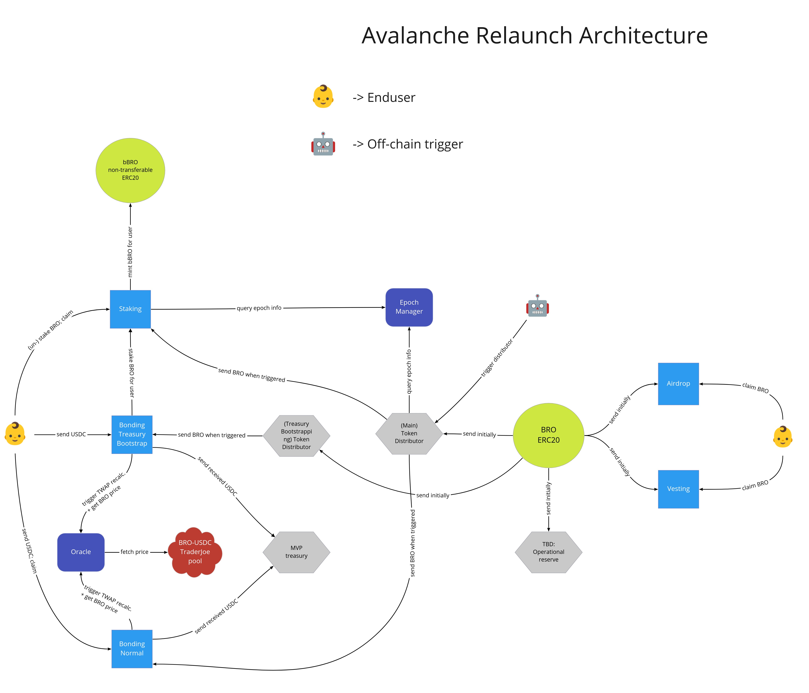

[](https://github.com/block42-blockchain-company/dao-core/actions/workflows/test.yml)
[](https://github.com/block42-blockchain-company/dao-core/actions/workflows/lint.yml)
[](https://github.com/block42-blockchain-company/dao-core/actions/workflows/coverage.yml)
[](https://docs.mythx.io/dashboard/github-badges)

# Brokkr Protocol ("Brotocol") Core Contracts

All contracts related to the BRO token.

In case you have improvement ideas or questions, you can reach us via [discord](https://discord.com/invite/CDNKYTDqTE),
or open an issue in this repository.

## Architecture Diagram



## Contracts

| Name                                                 | Description                                                          |
| ---------------------------------------------------- | -------------------------------------------------------------------- |
| [`Airdrop`](contracts/Airdrop.sol)                   | Eligible wallets can claim BRO                                       |
| [`bBroToken`](contracts/BBroToken.sol)               | Non-transferable ERC20 token                                         |
| [`BroToken`](contracts/BroToken.sol)                 | ERC20 token                                                          |
| [`BondingV1`](contracts/BondingV1.sol)               | Send bonding token, claim discounted BRO or stake inside staking     |
| [`EpochManager`](contracts/EpochManager.sol)         | Stores global information needed for multiple contracts              |
| [`ProtocolMigrator`](contracts/ProtocolMigrator.sol) | Is used to migrate protocol state from Terra -> Avax                 |
| [`StakingV1`](contracts/StakingV1.sol)               | Stake BRO, claim BRO and bBRO                                        |
| [`TokenDistributor`](contracts/TokenDistributor.sol) | Transfers BRO from the rewards pool to bonding and staking contracts |
| [`Treasury`](contracts/Treasury.sol)                 | Holds any funds                                                      |
| [`TWAPOracle`](contracts/TWAPOracle.sol)             | TWAP oracles for bonding                                             |
| [`Vesting`](contracts/Vesting.sol)                   | Eligible wallets can claim BRO according to the schedules            |

## Testing

Run unit tests via

```
yarn test
```

## How to build

Compile the contracts to wasm files with

```
yarn compile
```

## Deployment

TBD

## Basic CI

- Unit tests check
- Linter check
- Coverage check

## Detailed Contract descriptions

For the access assumptions of all contracts, please check the [dedicated docs page](https://docs.brokkr.finance/brotocol/technical-docs/access/dao-contracts).

### [`Airdrop`](contracts/Airdrop.sol) 
The Airdrop contract allows eligible addresses to claim a predefined amount of BRO token.

All eligible addresses are stored together with their associated claimable BRO in a Merkle tree structure.
The verification whether an address is elibigle is done via submitting the correct Merkle proof to the claim function.
The merkle proof is then verified against the merkle root that's stored in the contract, and if successful, the claiming address receives BRO.
Once an address claimed, it cannot claim again.

It's possible to upload multiple merkle roots in the contract.
Each new merkle root belongs to a new "stage".

Currently this contract has only stage 1:
Eligible addresses for stage 1 are historic thorguard and Lunabulls / theBullClub holders that already claimed their airdrop BRO on the deprecated Terra airdrop contract.

### [`BroToken`](contracts/BroToken.sol)
This is a stock upgradeable ERC20 contract [taken from openzeppelin](https://github.com/OpenZeppelin/openzeppelin-contracts-upgradeable/blob/master/contracts/token/ERC20/ERC20Upgradeable.sol)

The only addition is that the contract is made ownable in order to change the name and symbol of the token.
In case of a future rebranding, this comes in handy.

No owner functionality to minting, transfer, or any other vital base ERC20 functionality was added.

### [`bBroToken`](contracts/BBroToken.sol)
This is a stock upgradeable ERC20 contract [taken from openzeppelin](https://github.com/OpenZeppelin/openzeppelin-contracts-upgradeable/blob/master/contracts/token/ERC20/ERC20Upgradeable.sol) with a twist: it's not possible to transfer the token.

The idea is that bBRO represents the long term loyalty of a user. Loyalty shouldn't be transferable.

Furthermore, whitelisted addresses can mint new bBRO.
This is to allow the staking contract to issue new bBRO based on the staking behaviour of the user.

Another addition is that the contract is made ownable in order to change the name and symbol of the token.
In case of a future rebranding, this comes in handy.

### [`BondingV1`](contracts/BondingV1.sol)
There are two kinds of bonding contract modes:
- Normal
- Community / Treasury Bootstrapping

Normal:
The Bonding contract allows users to trade a predefined token (e.g. USDC) for discounted BRO.
The bonders receives after a cliff period more BRO than they would have received if they would have bought at the same time BRO on the market.

Community / Treasury Bootstrapping:
The Bonding contract allows users to trade a predefined token (e.g. USDC) for discounted BRO *in staked state*.
The bonders receives immediately more staked BRO than they would have received if they would have bought at the same time BRO on the market.
The unstaking period is depending on the configuration, but will be initially 365 epochs.

In both modes, the sent USDC (or specified token) is then sent to the treasury contract.
That way, the treasury can bootstrap by issuing discounted BRO to long term (community mode) and short term (normal mode) believers.


### [`EpochManager`](contracts/EpochManager.sol)
This contract allows other contracts to query the time period for 1 epoch.
Most time based actions are counted in epochs, therefore it's vital that all contracts have the same "global" truth.

For the unforseeable future, one epoch will equal 1 day.

### [`ProtocolMigrator`](contracts/ProtocolMigrator.sol)
This contract allows easy migration of former Terra users.
The contract takes a list of addresses, and assigns them a predefined amount of BRO, bBRO and staked BRO.

That way, we "re-populate" our DAO users according to the snapshot taken on Terra.

Initially this contract will migrate many addresses, and then later it will migrate users on an ad-hoc basis.

### [`StakingV1`](contracts/StakingV1.sol)
The staking contract allows BRO holders to stake their BRO in order to receive BRO and bBRO rewards.

Once a certain amount of BRO is staked by a user, he cannot transfer them anymore (= cannot sell on the market).
In order to make the receive the staked BRO again in the users wallet, the user has to unstake the BRO and wait until the unstaking period is over.
After the unstaking period is over, the user can claim BRO and receives BRO in her wallet.

When staking, the user can select how long the unstaking period should be of the staked amount of BRO.
The longer the unstaking period, the higher the *bBRO* rewards.

Once a user has staked BRO, she can claim rewards every epoch.

Initially the minimum unstaking period will be 14 epochs, and the maximum unstaking period 365 - [check out the docs](https://docs.brokkr.finance/brotocol/dao/staking) for more info.

### [`TokenDistributor`](contracts/TokenDistributor.sol)
This contract holds BRO, and distributes it once per epoch to specified contracts.
The idea is that the staking and bonding contract only receive a certain of tokens per epoch.

That way, stakers receive over time rewards instead of everything at once, 
and only a certain amount can be bonded per epoch instead of bonding everything away on day 1.

### [`Treasury`](contracts/Treasury.sol)
The Treasury contract is meant to hold and transfer native and ERC20 tokens.

Before any ERC20 token can be transferred, it has to be whitelisted.
This is meant to increase security when working with potentially malicious token contracts.

Only the contract owner can call functions.

### [`TWAPOracle`](contracts/TWAPOracle.sol)
This contract represents a time weighted average price (TWAP) oracle.
It averages the most recent price of one or more UniswapV2 style liquidity pools.

The TWAPOracle contract is needed by the bonding contract.
In order to calculate how much BRO a bonder should receive, the bonding contract consults the TWAP oracle.


### [`Vesting`](contracts/Vesting.sol)
This contract is meant for seed and private round investors.
In the vesting contract is specified *which address* can claim *how much BRO* at *what time*.

The vesting periods are uploaded by the contract owner, and can be reviewed in the [tokenomics docs](https://docs.brokkr.finance/brotocol/dao/tokenomics)
